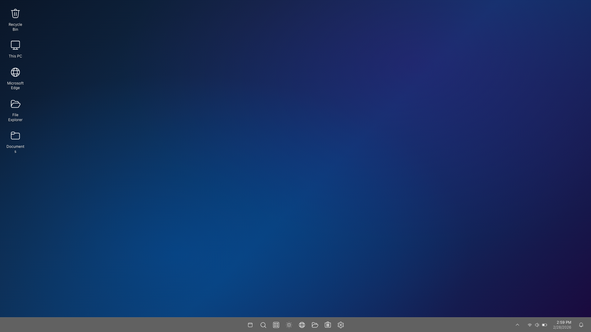
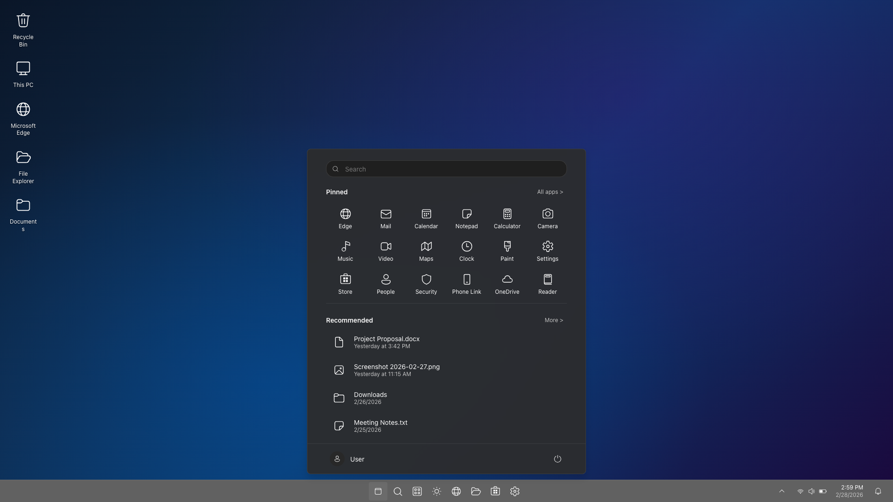
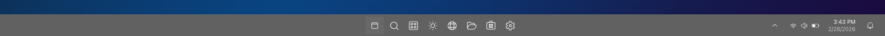

<div align="center">

# 🪟 Windows 11 Web UI

**A high-fidelity recreation of the Windows 11 desktop environment, built entirely with web technologies.**

[](https://react.dev)
[](https://www.typescriptlang.org)
[](https://vite.dev)
[](./LICENSE)
[](./tests)

[Live Demo](#) · [Screenshots](#-screenshots) · [Getting Started](#-getting-started)

</div>

---

## ✨ Features

- 🖥️ **Desktop** — Wallpaper background with clickable shortcut icons (select, deselect, double-click ready)
- 📌 **Taskbar** — Pixel-accurate 48px taskbar with acrylic blur, centered icons, and tooltips
- 🔍 **Start Menu** — Animated overlay with search bar, 18 pinned apps, recommended section, and user/power row
- 🕐 **System Tray** — Live clock, Wi-Fi/volume/battery indicators, notification bell
- 🎨 **Windows 11 Dark Theme** — Exact color tokens, typography, spacing, and rounded corners
- 🧩 **Extensible Architecture** — Every interactive element accepts callback props for future functionality

## 📸 Screenshots

> **Note:** To add screenshots, run the app (`npm run dev`), take screenshots at 1920×1080, save them to a `docs/screenshots/` folder, and update the paths below.

<!-- 
Uncomment and update paths after adding screenshots:

### Desktop


### Start Menu


### Taskbar

-->

| Desktop | Start Menu | Taskbar |
|---------|-----------|---------|
|  |  |  |

## 🚀 Getting Started

### Prerequisites

- [Node.js](https://nodejs.org/) 18+ (LTS recommended)
- npm 9+

### Installation

```bash
git clone https://github.com/gbFinch/windows-11-web-ui.git
cd windows-11-web-ui
npm install
npm run dev
```

Open [http://localhost:5173](http://localhost:5173) in your browser.

### Scripts

| Command | Description |
|---------|-------------|
| `npm run dev` | Start development server with HMR |
| `npm run build` | Type-check and build for production |
| `npm run preview` | Preview production build locally |
| `npm run test` | Run all tests |
| `npm run test:watch` | Run tests in watch mode |
| `npm run lint` | Lint source code with ESLint |
| `npm run format` | Format code with Prettier |

## 🏗️ Architecture

```
src/
├── components/
│   ├── Desktop/          # Desktop surface + shortcut icons
│   ├── Taskbar/          # Taskbar, Start button, system tray, clock
│   └── StartMenu/        # Start Menu, search, pinned apps, recommended
├── data/                 # Static content (icon lists, app lists)
├── styles/               # Global theme tokens + CSS reset
└── types/                # Shared TypeScript interfaces
```

### Component Tree

```
App
├── Desktop
│   └── DesktopIcon × 5
├── Taskbar
│   ├── StartButton
│   ├── TaskbarIcon × 7
│   └── SystemTray
│       └── Clock
└── StartMenu (conditional)
    ├── SearchBar
    ├── PinnedApps → AppTile × 18
    ├── RecommendedSection → RecommendedItem × 4
    └── UserPowerRow
```

### Design Decisions

- **Props-down, callbacks-up** — No state management library. Two `useState` calls in App handle all state.
- **CSS Modules** — Zero-runtime component-scoped styles. No CSS-in-JS overhead.
- **CSS Custom Properties** — Full Windows 11 dark theme palette in `src/styles/theme.css`. Change one variable, update everywhere.
- **Static data arrays** — Desktop icons, taskbar icons, and pinned apps are defined in `src/data/` as typed constants.

## 🎨 Design Tokens

All Windows 11 design values are centralized in [`src/styles/theme.css`](src/styles/theme.css):

```css
:root {
  --color-accent: #0078d4;
  --color-surface-primary: #2d2d2d;
  --color-taskbar: rgba(30, 30, 30, 0.7);
  --radius-medium: 8px;
  --shadow-flyout: 0 8px 16px rgba(0,0,0,0.14), 0 0 2px rgba(0,0,0,0.12);
  /* ... 60+ tokens */
}
```

## 🔌 Extensibility

Every interactive component accepts optional callback props. Adding functionality requires zero structural changes:

```tsx
// Before (v1 — no action)
<DesktopIcon id="edge" icon={<GlobeRegular />} label="Edge" />

// After (v2 — launches a window)
<DesktopIcon
  id="edge"
  icon={<GlobeRegular />}
  label="Edge"
  onDoubleClick={(id) => openWindow(id)}
/>
```

## 🧪 Testing

22 tests across 7 test files using [Vitest](https://vitest.dev) + [React Testing Library](https://testing-library.com/docs/react-testing-library/intro/):

```bash
npm run test
```

Tests cover:
- Desktop icon selection and deselection
- Start button toggle behavior
- Clock time/date formatting
- Start Menu content rendering
- App tile click callbacks

## 🛣️ Roadmap

- [ ] Functional windows (open, close, minimize, maximize, drag, resize)
- [ ] Right-click context menus
- [ ] Desktop icon drag-and-drop with grid snapping
- [ ] Light theme support
- [ ] Keyboard navigation and accessibility
- [ ] Sound effects
- [ ] File Explorer mock UI

## 📄 License

This project is licensed under the [MIT License](./LICENSE).

## ⚠️ Disclaimer

This project is a fan-made recreation for educational and demonstration purposes. It is not affiliated with, endorsed by, or connected to Microsoft Corporation. Windows, Windows 11, and the Windows logo are trademarks of Microsoft Corporation. All product names, logos, and brands are property of their respective owners.

---

<div align="center">

**Built with ❤️ using React, TypeScript, and Vite**

</div>
